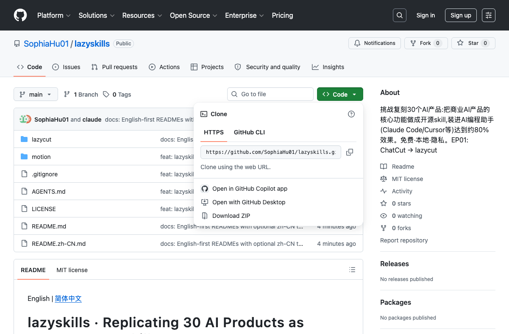
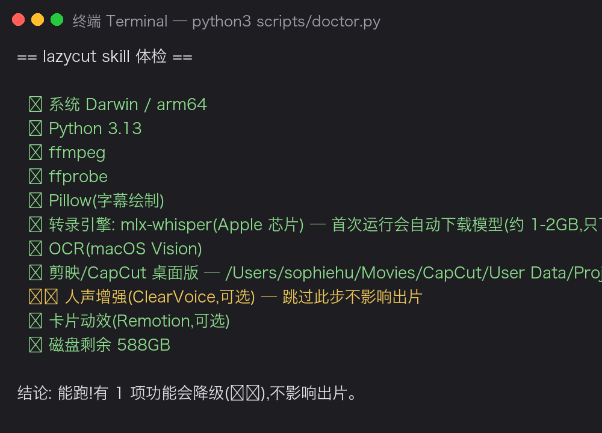
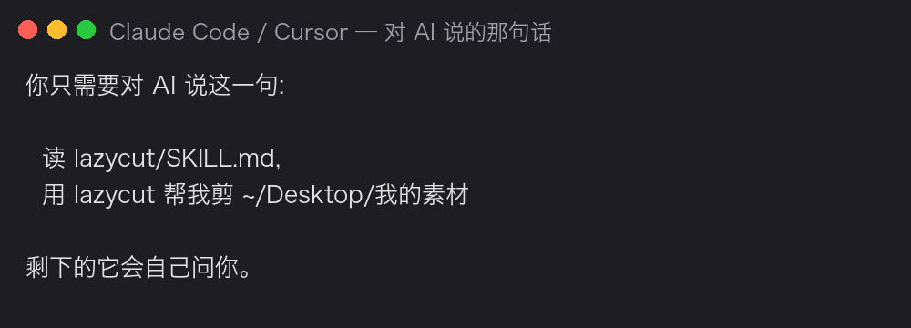
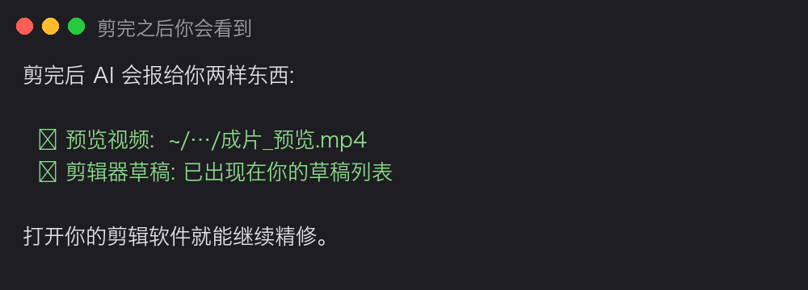

English | [简体中文](tutorial.zh-CN.md)

# Absolute-Beginner Tutorial: lazycut from zero (no code knowledge needed)

> You need: a computer (Mac is smoothest, Windows works) + an AI coding assistant
> (Claude Code or Cursor) + your video editor (CapCut/JianYing). Everything is free and
> nothing ever leaves your machine.

## Step 1 — Download lazycut

Open the repo page → click the green **Code** button → **Download ZIP** → unzip.
(`git clone` works too, same result.)

## Step 2 — Let the AI health-check your machine

Open your AI coding assistant, point it at the unzipped folder, and say:

> Run lazycut's doctor check and install whatever is missing.

You'll get a report like this:

Green ✅ = ready; yellow ⚠️ = a feature degrades gracefully; red ❌ = something to
install — **you don't need to research anything, the AI reads this report and installs
it for you**. Model downloads (~1–2 GB) happen once.

## Step 3 — Start with one sentence

Put your footage in a folder and tell the AI:

On first use it asks a few one-time questions: which editor you use; six style questions
(word-pop captions or not, highlight color, pacing, retake habits, your filler words,
end-card branding); and if your editor has zero drafts, it walks you through a 40-second
ritual (new draft → drop in any clip → add one caption → save) so it can learn your
editor's file format from a real draft on your machine.

## Step 4 — Nod at three checkpoints

It never bulldozes ahead. It stops for your written OK at three moments:
**before cutting** (the polished transcript + style questions), **before rendering
animations** (each one listed with its justification), and **before sending anything
anywhere**.

## Step 5 — Collect

Open your editor: a new draft appears in your draft list — clips, captions and cards on
separate tracks. Tweak anything by hand and export from the editor as usual.

(Screenshots of the CapCut draft list and timeline are coming shortly.)

## FAQ

**Changed your mind mid-way?** Just say it — "delete sentence 3", "bigger captions".
Your words are the commands; only the affected steps re-run.
**Not your taste?** Correct it. Every correction goes into your local mistake journal;
the same mistake doesn't happen twice.
**Is anything uploaded?** No. Transcription, editing, captions all run locally.
No account, no server.
**Stuck during install?** Paste the exact error to your AI — every error message is
written so an AI can self-rescue. Still stuck? Open an issue with the error.
